# Comparison of Monocular Visual-Inertial Odometry in Aerial Drones

_Converted from the thesis PDF for GitHub-friendly viewing. Figures are extracted from the PDF pages._

## Page 1

Institut for Elektro- og Computerteknologi
Bachelor Project
Comparison of Monocular Visual-Inertial
Odometry in Aerial Drones
Mads Evander Jensen
MEJ
Student no. 202107547
AU-id: AU705673
Jeppe Emil Smedegaard Pape
JESP
Student no. 202008596
AU-id: AU682984
Supervisor: Andriy Sarabakha
DATE
May 29, 2025
Number of characters: 72,620 with spaces

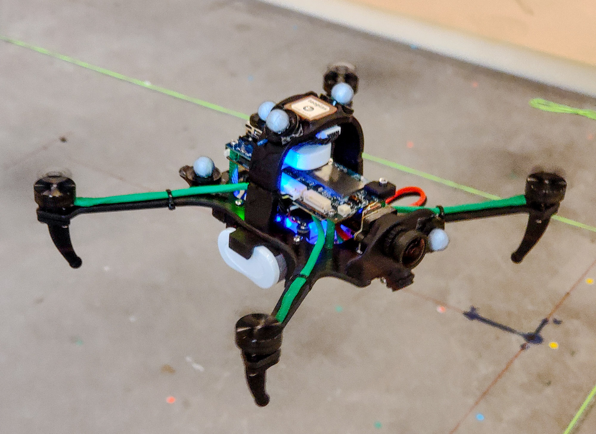

## Page 2

Comparison of Odometry
2
PREFACE
1
Abstract
Monocular Visual-Inertial Odometry (VIO) refers to the process of estimating a robot’s po-
sition and velocity relative to its environment using a single camera (monocular vision) in
combination with inertial sensors. This project focuses specifically on applying and bench-
marking VIO methods in aerial platforms — particularly Micro Aerial Vehicles (MAVs) —
although many of the insights gained are also applicable to other drone platforms as well
as AR/VR systems.
We implemented and evaluated multiple state-of-the-art VIO systems on an aerial drone
platform. Our findings reveal significant variation in the performance of these methods
— both in terms of trajectory accuracy and computational efficiency — highlighting the
importance of careful system selection and tuning in real-world deployment scenarios.
2
Preface
We would like to thank to our supervisor, Andriy Sarabakha, for his guidance throughout
this project and for providing us with the necessary equipment and support. We also wish
to thank the Department of Electrical and Computer Engineering at Aarhus University for
granting us access to office space and research facilities. This support made it possible for
our bachelor project to go beyond theory, incorporating custom drone flights and offering
hands-on experience with drone calibration and dataset collection.
Abbreviation
Full Form
AU
Aarhus University
VR/VR
Virtual- /Augmented Reality
MAV
Micro Air Vehicle
UAV
Unmanned Aerial Vehicle
VIO
Visual-Inertial Odometry
SLAM
Simultaneous Localization And Mapping
CPU
Central Processing Unit
RAM
Random-Access Memory
IMU
Inertial Measurement Unit
ATE
Absolute Trajectory Error
MAE
Mean Absolute Error
RMSE
Root Mean Square Error
ROS
Robot Operating System
FAST
Features from Accelerated Segment Test
BRIEF
Binary Robust Independent Elementary Features
ORB
Oriented FAST and rotated BRIEF
ADB
Android Debug Bridge
Table 1: List of abbreviations used in this project

## Page 3

Comparison of Odometry
CONTENTS
Contents
1
Abstract
2
Preface
3
Introduction
1
3.1
Motivation
. . . . . . . . . . . . . . . . . . . . . . . . . . . . . . . . . . . . . . . . . . . . . .
1
3.2
Procedure . . . . . . . . . . . . . . . . . . . . . . . . . . . . . . . . . . . . . . . . . . . . . . .
1
3.3
Research Objective . . . . . . . . . . . . . . . . . . . . . . . . . . . . . . . . . . . . . . . . . .
1
3.3.1
Responsibilities by Section
. . . . . . . . . . . . . . . . . . . . . . . . . . . . . . . . .
2
3.4
Thesis Structure
. . . . . . . . . . . . . . . . . . . . . . . . . . . . . . . . . . . . . . . . . . .
2
4
Background
3
4.1
Visual-Inertial Odometry
. . . . . . . . . . . . . . . . . . . . . . . . . . . . . . . . . . . . . .
3
4.2
Benchmarking Datasets
. . . . . . . . . . . . . . . . . . . . . . . . . . . . . . . . . . . . . . .
4
4.2.1
EuRoC dataset . . . . . . . . . . . . . . . . . . . . . . . . . . . . . . . . . . . . . . . .
4
4.2.2
AUDrone dataset . . . . . . . . . . . . . . . . . . . . . . . . . . . . . . . . . . . . . . .
5
5
Methodology
6
5.1
Research Approach . . . . . . . . . . . . . . . . . . . . . . . . . . . . . . . . . . . . . . . . . .
6
5.1.1
Setup
. . . . . . . . . . . . . . . . . . . . . . . . . . . . . . . . . . . . . . . . . . . . .
6
5.1.2
Evaluation metrics . . . . . . . . . . . . . . . . . . . . . . . . . . . . . . . . . . . . . .
6
5.2
Selection of VIO methods . . . . . . . . . . . . . . . . . . . . . . . . . . . . . . . . . . . . . .
6
6
System Setup and Configuration
8
6.1
Configuration of VIO systems . . . . . . . . . . . . . . . . . . . . . . . . . . . . . . . . . . . .
8
6.1.1
ORB-SLAM3 ROS2 . . . . . . . . . . . . . . . . . . . . . . . . . . . . . . . . . . . . .
8
6.1.2
IMU combiner
. . . . . . . . . . . . . . . . . . . . . . . . . . . . . . . . . . . . . . . .
8
6.1.3
VINS-Mono . . . . . . . . . . . . . . . . . . . . . . . . . . . . . . . . . . . . . . . . . .
9
6.1.4
VINS-Fusion
. . . . . . . . . . . . . . . . . . . . . . . . . . . . . . . . . . . . . . . . .
9
6.1.5
SVO-PRO (rpg svo pro open) . . . . . . . . . . . . . . . . . . . . . . . . . . . . . . . .
9
6.1.6
R-VIO . . . . . . . . . . . . . . . . . . . . . . . . . . . . . . . . . . . . . . . . . . . . .
9
6.1.7
VI-Stereo-DSO . . . . . . . . . . . . . . . . . . . . . . . . . . . . . . . . . . . . . . . .
9
6.1.8
Maplab
. . . . . . . . . . . . . . . . . . . . . . . . . . . . . . . . . . . . . . . . . . . .
10
6.1.9
OKVIS2 . . . . . . . . . . . . . . . . . . . . . . . . . . . . . . . . . . . . . . . . . . . .
10
6.1.10 Kimera
. . . . . . . . . . . . . . . . . . . . . . . . . . . . . . . . . . . . . . . . . . . .
10
6.2
Data Preparation and Preprocessing . . . . . . . . . . . . . . . . . . . . . . . . . . . . . . . .
10
6.3
px4 drone Setup and Calibration . . . . . . . . . . . . . . . . . . . . . . . . . . . . . . . . . .
11
6.4
Recording the AUDrone dataset
. . . . . . . . . . . . . . . . . . . . . . . . . . . . . . . . . .
12
7
Testing
15
7.1
AU drone . . . . . . . . . . . . . . . . . . . . . . . . . . . . . . . . . . . . . . . . . . . . . . .
15
7.2
Evaluation Metrics . . . . . . . . . . . . . . . . . . . . . . . . . . . . . . . . . . . . . . . . . .
15
7.3
Testing Procedure and Reproducibility . . . . . . . . . . . . . . . . . . . . . . . . . . . . . . .
16
7.3.1
Automation of programs on all 11 bags
. . . . . . . . . . . . . . . . . . . . . . . . . .
16
7.3.2
Automation of trajectory data conversion . . . . . . . . . . . . . . . . . . . . . . . . .
16
7.3.3
Automation of Evo evaluation with the groundtruths . . . . . . . . . . . . . . . . . . .
17
7.3.4
Guaranteeing fairness
. . . . . . . . . . . . . . . . . . . . . . . . . . . . . . . . . . . .
17
8
Results
18
8.1
Accuracy
. . . . . . . . . . . . . . . . . . . . . . . . . . . . . . . . . . . . . . . . . . . . . . .
18
8.2
Resource Usage . . . . . . . . . . . . . . . . . . . . . . . . . . . . . . . . . . . . . . . . . . . .
22
9
Discussion
24

## Page 4

Comparison of Odometry
CONTENTS
9.1
Key Findings . . . . . . . . . . . . . . . . . . . . . . . . . . . . . . . . . . . . . . . . . . . . .
24
9.2
Strengths and Weaknesses of Evaluated VIOs . . . . . . . . . . . . . . . . . . . . . . . . . . .
24
9.3
Challenges Encountered During Research
. . . . . . . . . . . . . . . . . . . . . . . . . . . . .
24
9.4
Limitations of the Study . . . . . . . . . . . . . . . . . . . . . . . . . . . . . . . . . . . . . . .
25
9.5
Lessons Learned
. . . . . . . . . . . . . . . . . . . . . . . . . . . . . . . . . . . . . . . . . . .
26
10 Conclusion
27
11 Attachments
29
11.1 PX4 developer kit - kalibr calibration results
. . . . . . . . . . . . . . . . . . . . . . . . . . .
29

## Page 5

Comparison of Odometry
3
INTRODUCTION
3
Introduction
3.1
Motivation
The growing demand for autonomous aerial vehicles in applications such as inspection, surveillance, and de-
livery depends heavily on their ability to navigate reliably and accurately in complex environments. Monoc-
ular Visual-Inertial Odometry (VIO) offers a promising solution by fusing data from a single camera and
an inertial measurement unit (IMU) to estimate the drone’s pose in real time. However, the performance
of VIO methods varies significantly depending on factors such as environmental complexity, computational
constraints, and the underlying algorithm.
In this thesis, we aim to evaluate and compare the performance of several VIO methods by analyzing the
estimated pose accuracy, CPU and memory usage across different datasets. Monocular VIO was specifically
selected since it only requires the single camera and IMU, which most drones already has. The goal is to
provide actionable insights into the practical deployability of these methods for achieving robust and efficient
navigation in real-world aerial drone operations.
3.2
Procedure
To evaluate the performance of several state-of-the-art VIO methods, we implement and test them on two
distinct datasets: the EuRoC MAV dataset [1], which provides a well-established benchmark with widespread
reproducibility and high-quality ground truth; and a custom dataset captured at the AU Air Laboratory,
offering a controlled indoor environment and valuable insights into real-world deployment conditions. Ac-
curacy is assessed by comparing the estimated pose trajectories from each VIO method to corresponding
ground truth data. We also measure CPU and memory usage to understand each method’s computational
efficiency and practical suitability for deployment on resource-constrained platforms.
• Identify, implement, and configure several state-of-the-art monocular VIO methods relevant to aerial
robotics.
• Develop a unified evaluation framework to assess these methods across multiple performance metrics.
• Measure pose accuracy, CPU load, and memory usage across all tested VO and VIO methods.
3.3
Research Objective
The primary objective of this research is to evaluate and compare the performance characteristics of various
VIO methods. Focusing on key metrics such as pose accuracy and resource usage, the study aims to determine
the practical suitability of each method for autonomous aerial drone navigation. Ultimately, this work serves
as a guide for selecting VIO systems that balance accuracy, efficiency, and deployability in real-world drone
applications.
1

## Page 6

Comparison of Odometry
3
INTRODUCTION
3.3.1
Responsibilities by Section
Section / Subsection
Mads
Jeppe
3 Introduction
X
X
4 Background
X
X
5 Methodology
X
X
6 System Setup and Configuration
6.1 Configuration of VIO Systems
X
6.2 Data Preparation and Preprocessing
X
X
6.3 PX4 Drone Setup and Calibration
X
6.4 Recording the AUDrone Dataset
X
X
7 Testing
7.1 AUDrone
X
X
7.2 Evaluation Metrics
X
X
7.3 Testing Procedure and Reproducibility
X
8 Results
X
9 Discussion
X
X
10 Conclusion
X
X
Table 2: Contribution breakdown by report structure
3.4
Thesis Structure
This thesis is organized to guide the reader through our process of evaluating and comparing VIO systems.
We begin with a Background section introducing core VIO concepts and the datasets used for benchmarking.
This is followed by the Methodology, detailing our experimental approach.
The System Setup and Configuration section outlines how the VIO systems were installed, configured, and
prepared for testing. Testing Procedures then describes the evaluation metrics, dataset playback methods,
and the steps taken to ensure reproducibility.
The Results section presents our empirical findings, followed by a Discussion that interprets the outcomes,
highlights strengths and weaknesses of each system, and reflects on challenges, limitations, and lessons
learned.
Finally, the Conclusion summarizes the research and outlines directions for future work.
2

## Page 7

Comparison of Odometry
4
BACKGROUND
4
Background
4.1
Visual-Inertial Odometry
Monocular visual-inertial odometry (VIO) leverages data from a single camera and an inertial measurement
unit (IMU) to estimate the position, altitude and orientation (pose) of a robot or drone. While camera-based
estimation is generally accurate during low-speed navigation, it suffers from challenges such as motion blur,
feature track loss, and scale ambiguity during high-speed motion. In contrast, inertial navigation systems
perform well in high-speed scenarios and provide pose estimates on a world scale, but suffer from drift and
noise over time.
By fusing these two complementary sensor types, VIO offers a balance of accuracy and robustness, making
it well-suited for a range of real-world applications, including aerial robotics.
This project focuses specifically on monocular VIO. Compared to multi-camera systems, monocular setups
present a harder problem. This is because, unlike stereo setups which can use triangulation from two or more
cameras to estimate depth, or LiDAR-based systems that directly measure distances, monocular systems lack
these immediate depth cues. They also don’t have overlapping fields of view that multi-camera systems use
for redundancy and improved accuracy. However, monocular setups offer advantages in terms of weight,
complexity, and power consumption—critical factors for aerial drones.
The VIO methods evaluated in this project differ in design and functionality. One common feature among
several methods is their integration of SLAM (Simultaneous Localization and Mapping), where a system
builds a map of its environment while tracking its own position within it.
However, our focus is solely
on the VIO component, and it is important to note that SLAM-capable methods may incur additional
computational overhead.
Another frequent feature is loop closure, which refers to the process of recognizing previously visited locations
to correct drift accumulated over time. This improves long-term consistency of the estimated trajectory.
Some of the tested methods include loop closure, while others do not. For the purposes of this benchmark,
we evaluate each system’s overall performance regardless of such auxiliary features.
To comprehensively evaluate VIO methods, we selected VIO methods with various feature detection and
description algorithms, a crucial component of VIO. The most common feature detection algorithms include
FAST, ORB and Shi-Tomasi methods.
• FAST is a corner detection algorithm known for its computational efficiency. It identifies potential
corner points by examining a circular region of 16 pixels around a candidate pixel. A pixel is classified
as a corner if a sufficient number of consecutive pixels on the circle are either significantly brighter or
significantly darker than the candidate pixel itself. This method is much faster than many other corner
detectors, making it suitable for real-time applications.
• ORB is another highly efficient and robust feature detection and description algorithm that builds
on FAST. It first uses the FAST algorithm to detect keypoints in an image.
Then, it applies a
modified Harris corner measure to select the strongest keypoints. For each keypoint, ORB calculates
its orientation and then computes a binary descriptor called rBRIEF. rBRIEF is an improvement over
the original BRIEF descriptor, making it more robust to rotation by ”steering” the sampling pattern
according to the keypoint’s orientation.
• Shi-Tomasi is an improvement upon the Harris corner detector. Both algorithms use the concept of
an ”autocorrelation matrix” to analyze how much the image intensity changes when a small window
is shifted in different directions. While Harris uses a specific scoring function based on the eigenvalues
(λ1, λ2) of this matrix (R = λ1λ2 −k(λ1 + λ2)2), Shi-Tomasi simplifies this by defining a corner as a
point where the minimum of the two eigenvalues (min(λ1, λ2)) is above a certain threshold.
Some methods, such as VI-DSO, use a direct approach instead. Instead of extracting and matching discrete
features, they minimize photometric error — the difference in pixel intensity between frames — directly over
image regions. [2]
3

## Page 8

Comparison of Odometry
4
BACKGROUND
Figure 1 showcases the user interface of a running VIO method, specifically VI-DSO[3]. This particular
method incorporates SLAM, which is represented by the sparse 3D point cloud.
The VIO’s estimated-
and groundtruth tradjectories are overlayed in real-time, giving a clear view of how accurate the VIO is.
Additionally, the camera view is displayed in the corner with feature tracking points overlaid.
Figure 1: VI-DSO UI, featuring a sparse 3d point cloud and feature detection.
4.2
Benchmarking Datasets
To test the VIO methods we will run the methods on two different datasets. The widely used EuRoC-MAV
dataset [1], and our own recorded dataset on our own drone. Do take note, that the paper will generally
refer to the datasets loosely with the following terms, ”dataset” and ”bag”. Since both our own dataset and
the EuRoC-MAV dataset is going to be a singular dataset containing several underlying datasets in several
different formats, some of which are classified as ROS bags. So when either of the terms is used it will be
referring to either the overlying dataset as a whole or the singular dataset, that is a singular recording/bag.
4.2.1
EuRoC dataset
The EuRoC dataset is a collection of 11 different test drone flights, with varying movements ranging in
difficulty to map. The easy data to map is typically linear foreward movement in a bright environment,
while difficult is non-linear movement in all directions (sideways, backwards and rotation) and in low lighting.
These different scenarios are to test the VIO-method’s robustness to different real-world conditions. The
dataset includes stereo video, IMU data and the recorded ’ground truth’. The ground truth data is recorded
with a motion capture system and a laser tracker.
The EuRoC drone uses a Aptina MT9V034 global shutter camera at 20 fps, and a ADIS16448 IMU at 200
Hz. [1]
4

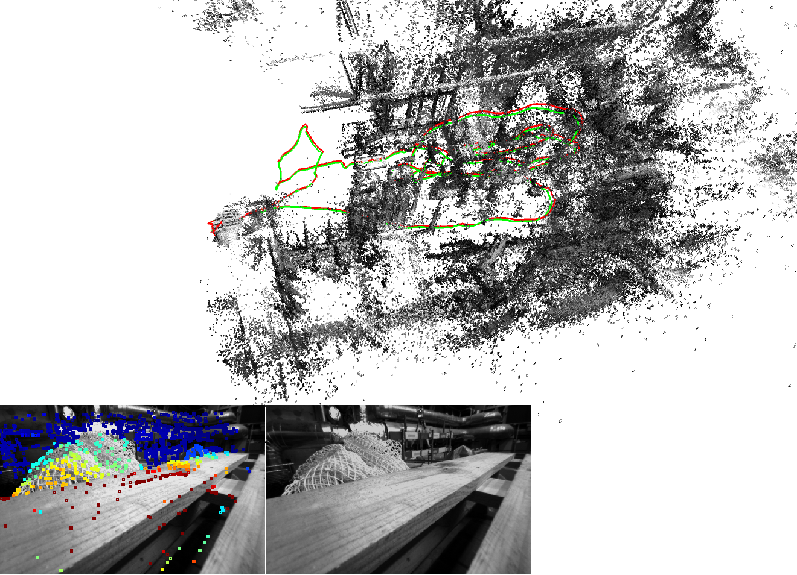

## Page 9

Comparison of Odometry
4
BACKGROUND
Figure 2: EuRoC dataset example image.
4.2.2
AUDrone dataset
We also created our own dataset by conducting flights in the AU Air Laboratory using a custom-made drone.
Three sequences were recorded, each with increasing levels of motion difficulty:
Easy: Slow, mostly translational motion
Medium: Moderate motion with added rotation
Hard: Fast, aggressive motion with combined translation and rotation
Ground truth data was collected using the lab’s VICON system, featuring 16 tracking cameras.
The drone used was a PX4 Autonomy Developer Kit featuring dual cameras and a time-synchronized IMU.
The tracking camera (On-Semi AR0144, global shutter) was used exclusively, as the other (a rolling shutter
camera) is unsuitable for VIO due to motion blur. The IMU ran at 1024Hz, and the camera captured at
29.97fps.
Further details on the calibration process and sensor synchronization are provided in the System Setup
chapter.
Example from dataset seen on figure 3.
Figure 3: AUDrone dataset example image.
5

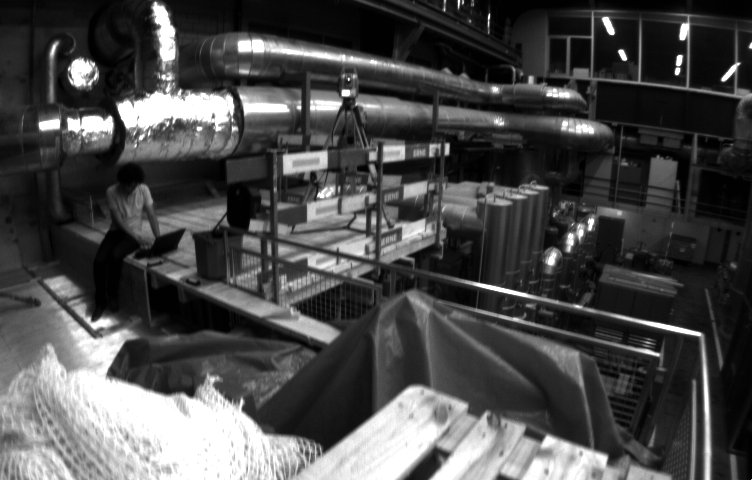

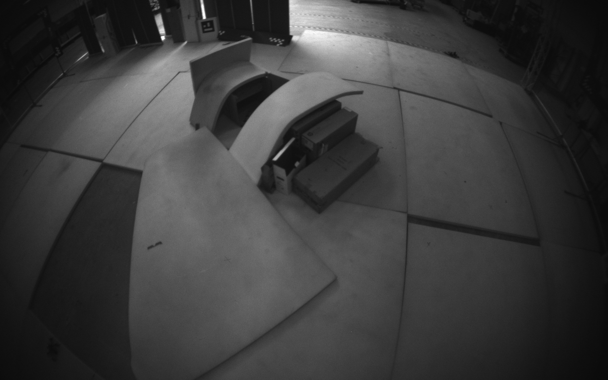

## Page 10

Comparison of Odometry
5
METHODOLOGY
5
Methodology
5.1
Research Approach
We adopt a quantitative, comparative research design to systematically evaluate the performance of various
monocular VIO algorithms. This approach is essential as it allows for direct comparison of algorithm capabil-
ities, identifying their relative strengths, weaknesses, and suitability for different operational environments,
contributing to an informed selection for future deployments.
5.1.1
Setup
All experiments were conducted on a single laptop equipped with an AMD Ryzen 9 5900HS CPU and 32GB
RAM, running a virtual machine (VM) with one of the following Ubuntu LTS distributions: 16.04, 18.04,
20.04, or 22.04. More setup details are provided in the System Setup chapter. All tests were performed on a
consistent hardware configuration to reduce variability and eliminate potential performance bias. Each VIO
algorithm was run using either its provided ROS wrapper or as a standalone executable.
For the EuRoC dataset, we used each algorithm’s default configuration to ensure a fair, out-of-the-box
comparison. For our own drone dataset, adjustments were made to account for hardware-specific calibration
parameters such as IMU noise characteristics, camera distortion, and image resolution. All such calibration
files are publicly available at: config files.
5.1.2
Evaluation metrics
The performance of each VIO method was quantitatively assessed using established metrics commonly em-
ployed in the visual odometry and SLAM literature. The primary evaluation metrics are:
• Absolute Trajectory Error (ATE): ATE measures the global consistency of a trajectory by comparing
estimated camera poses to ground truth after applying rigid-body alignment (rotation, translation,
and scale). In this project, we compute ATE as the Mean Absolute Error (MAE) of the translational
components. This choice was made to reduce the impact of outliers, which can disproportionately affect
metrics like Root Mean Square Error (RMSE). The result is a single scalar value that reflects global
trajectory drift. This metric is crucial because, for drone applications, accurate global positioning is
paramount for autonomous navigation. A low ATE indicates that the drone’s estimated path closely
matches its true path, which is essential for reliable operation in complex environments. [4]
• Computational Performance: We measured the average CPU utilization (as a percentage of total ca-
pacity across 12 threads) and memory usage (as a percentage of total system RAM) for each algorithm.
These measurements help determine the method’s real-time suitability and resource efficiency. The se-
lection of these computational metrics is driven by the inherent constraints of drone platforms, which
typically have limited onboard processing power and memory.
An optimal VIO method for drone
integration must not only be accurate but also computationally lightweight enough to run in real-time
without excessive resource consumption, thereby preserving battery life and allowing for other critical
drone operations.
These two measurements ensure that an optimal VIO method can be selected for a given drone, where
accuracy and computational requirements are typically trade-offs, directly addressing the practical needs of
drone-based applications.
5.2
Selection of VIO methods
To ensure a comprehensive evaluation, we aimed for a wide selection of VIO methods. Our criteria included
choosing a mix of established and actively developed techniques, with publicly available source code and
varied architectural designs (e.g., filter-based, optimization-based, feature-based, direct methods). Addi-
tionally, we specifically incorporated methods with SLAM capabilities to assess their potential impact on
performance. Overall the methods were loosely choosen based on this survey [VO-Survey], which not only
6

## Page 11

Comparison of Odometry
5
METHODOLOGY
links to a lot of visual odometry methods, but also gives a quick overview of their last activity, who made
it, which license it has and its features.
We went with the following 9 VIO methods for our testing. Based on both the advice of our advisor and
generally, which had a better combination of features and which we considered active.
• ORB-SLAM3 [5] A versatile, well-regarded, and widely referenced open-source system, ORB-SLAM3
provides SLAM capabilities for monocular, stereo, and RGB-D cameras, and also includes visual-
inertial functionality. Although the author is no longer actively developing it, the method remains
community-driven.
• Vins-Mono [6] VINS-Mono is an optimization-based monocular visual-inertial system. It is primarily
designed for state estimation and feedback control of autonomous drones and is also capable of providing
accurate localization for augmented reality (AR) applications.
• Vins-Fusion [7] VINS-Fusion is an extension of VINS-Mono.
Tt’s used for vision-aided autonomy,
SLAM, and AR, offering more flexibility in sensor configurations.
• SVO-PRO [8] SVO-PRO use a semi-direct approach, leveraging both pixel intensities and features
for motion estimation. SVO-PRO supports various camera types in monocular or stereo setups and
includes visual-inertial odometry and SLAM capabilities with loop closure. It is known for requiring
relatively low computational resources, making it an interesting option.
• Maplab 2.0 [9] Maplab focuses on multi-robot SLAM, enabling many diverse robots with various sensors
to collaboratively map large areas. A key feature is its integrated VIO method, ROVIOLI, which we
though would be interesting to include.
• VI-DSO [3] VI-DSO is a VIO approach that jointly estimates camera poses and sparse scene geometry
by minimizing photometric and IMU measurement errors. Unlike keypoint-based systems, it directly
minimizes a photometric error, allowing it to track pixels with sufficient intensity gradients. Could
potentially have higher accuracy in certain environments compared to feature-based methods.
• OKVIS2 [10] OKVIS2 is an extension of OKVIS, a lightweight optimization-based VIO method.
OKVIS2 includes features like loop closures and semantic segmentation for filtering dynamic objects,
enhancing its robustness and mapping capabilities. It’s still being actively developed.
• R-VIO [11] R-VIO is an efficient, lightweight, sliding-window filtering-based VIO. It’s specifically de-
signed to work well on monocular camera and a single IMU platforms.
• KIMERA [12] Kimera is a popular VIO and SLAM method, currently under active development.
It achieves robust pose estimation by tightly integrating visual and inertial data, compatible with
both monocular and stereo camera setups. Kimera also incorporates a more complex Simultaneous
Localization and Mapping (SLAM) system, enabling advanced features such as 3D mesh reconstruction
and semantic labeling.
7

## Page 12

Comparison of Odometry
6
SYSTEM SETUP AND CONFIGURATION
6
System Setup and Configuration
Each Visual-Inertial Odometry (VIO) system was configured in accordance with its official documentation.
Most systems provided ready-to-use configuration files tailored for the EuRoC MAV dataset. Where required,
only minimal modifications were introduced to ensure consistency and comparability across all methods.
One important adjustment involved enforcing headless execution. Not all systems offered native support for
running without a graphical user interface (GUI), which could otherwise skew performance metrics such as
CPU and memory usage. In such cases, we manually altered the source code to disable built-in visualizers
(e.g., Pangolin, RViz) to ensure fair benchmarking.
Core algorithmic parameters—such as the number of extracted features, loop closure settings, and threading
models—were kept at their default values. This decision was made to maintain a level playing field and
avoid introducing bias through uneven parameter tuning or system-specific optimizations.
6.1
Configuration of VIO systems
6.1.1
ORB-SLAM3 ROS2
This implementation was built on Ubuntu 22.04 with ROS2 Humble. Required dependencies included Pan-
golin (commit 122bb3e), OpenCV 4.4.0, Eigen3 3.4.0, and various third-party libraries. The project was
compiled using Colcon.
The original ROS2 wrapper of ORB-SLAM3 ROS2 does not support a monocular-inertial mode, only pro-
viding monocular and stereo-inertial configurations. To enable monocular-inertial support, we extended the
source code by adapting the logic from the existing stereo and monocular modes. The modified implemen-
tation, named MonoInertialNode, is available at: [Mono inertial code].
In this custom node, the constructor initializes three key components:
1. Subscribes to the camera and IMU topics, invoking GrabImage() and GrabImu() on message receipt.
2. Initializes a shared pointer to the ORB-SLAM3 system for monocular-inertial tracking.
3. Spawns a dedicated synchronization thread running SyncWithImu().
The GrabImage() and GrabImu() functions buffer incoming messages into queues with mutex-protected
access, ensuring thread safety. These methods also implement timestamp verification and optional logging
for debugging. In particular, GrabImage() attempts to identify the closest IMU measurement for logging,
while GrabImu() logs IMU timestamps for consistency checks.
The SyncWithImu() thread continuously synchronizes image and IMU data. For each new image, it extracts
all IMU measurements within a predefined time window and discards outdated or future-dated messages.
The resulting data is passed to TrackMonocular() in the ORB-SLAM3 backend.
This synchronization
process was essential to resolving early issues with NaN values, which we later traced to unsynchronized
IMU readings and insufficiently tuned recording configurations.
The system can be launched using the following command:
ros2 run
orbslam3 mono -inertial /home/jeppe/Desktop/Bachelor/colcon_ws/src/
orbslam3_ros2/vocabulary/ORBvoc.txt
/home/jeppe/Desktop/Bachelor/ORB_SLAM3/Examples/Monocular -Inertial/EuRoC.yaml
--ros -args --remap
camera :=/ cam0/image_raw
--remap imu :=/ imu0
6.1.2
IMU combiner
Additionally, a custom ROS2 node named imu combiner node was developed. This node aggregates IMU
messages from PX4’s dual topics: /fmu/out/sensor combined and /fmu/out/vehicle attitude. It pub-
lishes a new topic (/imu combined) used by ORB-SLAM3 ROS2. Beyond message fusion, the node includes
a logging utility that records various IMU-related topics (e.g., /imu combined, /imu0), assisting in debugging
timestamp mismatches, duplicate entries, and empty messages.
8

## Page 13

Comparison of Odometry
6
SYSTEM SETUP AND CONFIGURATION
This node is essential for all related AUDRONE datasets to function.
6.1.3
VINS-Mono
Tested on Ubuntu 16.04 with ROS Kinetic. Built using ‘catkin‘, with dependencies such as ‘cv bridge‘, ‘tf‘,
‘image transport‘, and ‘message filters‘.
Execution:
Terminal
1:
roslaunch
vins estimator
euroc . launch
Terminal
2:
roslaunch
vins estimator
v i n s r v i z . launch
Terminal
3:
rosbag
play /home/ jeppe /Desktop/Vins−Mono/MH 01 easy . bag
6.1.4
VINS-Fusion
Built and tested on Ubuntu 16.04 with ROS Kinetic, Ceres Solver 2.20, Eigen 3.3, and CMake 3.16. Compiled
using ‘catkin‘.
Execution:
Terminal
1:
roslaunch
vins
v i n s r v i z . launch
Terminal
2:
rosrun
vins
vins node /path/ to / euroc mono imu config . yaml
Terminal
3:
rosbag
play /home/ jeppe /Desktop/Vins−Mono/MH 01 easy . bag
6.1.5
SVO-PRO (rpg svo pro open)
Tested on Ubuntu 18.04 with ROS Melodic. Built using ‘catkin‘ with dependencies including ‘vcstools‘,
Ceres Solver, and (optionally) iSAM2 for global mapping. The iSAM2 module was not required and can be
omitted due to build issues.
Execution:
Terminal
1:
roscore
Terminal
2:
roslaunch
svo ros
euroc vio mono . launch
Terminal
3:
rosbag
play MH 03 medium . bag
6.1.6
R-VIO
Built on Ubuntu 16.04 with ROS Kinetic. Uses Eigen 3.1.0, OpenCV 3.3.1, and other standard ROS packages.
Compiled using ‘catkin‘.
Execution:
Terminal
1:
roscore
Terminal
2:
roslaunch
rvio
euroc . launch
Terminal
3:
rosbag
play /path/ to /MH 01 easy . bag /cam0/image raw:=/camera/image raw /imu0:=
6.1.7
VI-Stereo-DSO
Built on Ubuntu 20.04 with CMake and Make. Required libraries included SuiteSparse, Eigen3, OpenCV,
Pangolin (commit 122bb3e), and ziplib.
Execution:
Terminal
1:
./ run euroc . bash $DATASET PATH
9

## Page 14

Comparison of Odometry
6
SYSTEM SETUP AND CONFIGURATION
6.1.8
Maplab
Tested on Ubuntu 18.04 with ROS Melodic. Built using ‘catkin‘ and includes more than 150 dependencies.
Use of ‘ccache‘ is highly recommended to accelerate rebuilds. The ‘-j‘ flag for parallel builds should be used
with caution due to high memory demands.
Execution:
Terminal
1:
roscore
Terminal
2:
rosrun
r o v i o l i
t u t o r i a l e u r o c l i v e $OUTPUT MAP $BAG PATH
6.1.9
OKVIS2
Built on Ubuntu 20.04 with ROS Noetic. Dependencies include Glog, GFlags, Eigen3, SuiteSparse, CXS-
parse, Boost, OpenCV, and LibTorch. The project was cloned with ‘–recurse-submodules‘ and built using
standard ‘cmake‘ and ‘make‘.
Execution:
Terminal
1:
./ okvis app synchronous <path/ to / euroc . yaml> <path/ to /MH 01 easy/mav0/>
6.1.10
Kimera
Built on Ubuntu 20.04 with ROS Noetic. Dependencies were fetched using ‘wstool‘, but additional packages
may need to be manually installed. Note: Git credentials or conversion to HTTPS URLs may be necessary
during setup.
Execution:
Terminal
1:
roscore
Terminal
2:
roslaunch
kimera vio ros
kimera vio ros euroc . launch
Terminal
3:
rosbag
play −−clock $BAGFILE
6.2
Data Preparation and Preprocessing
To evaluate the VIO methods consistently, we required datasets that included ground truth trajectories and
were available in three formats: ROS 1 bag files, ROS 2 bag files, and EuRoC-MAV format. The EuRoC-
MAV dataset was an ideal choice, as it is widely adopted in the research community, well-supported across
VIO systems, and natively available in both ROS 1 and EuRoC-specific formats. Each dataset includes
synchronized image, IMU, and ground truth data, enabling precise evaluation.
The EuRoC datasets were downloaded directly from the official website[1], which provides 22 dataset files
covering all formats. The total download size was approximately 37.5 GB.
An additional preparation step was needed to convert the ROS 1 bags into ROS 2 format for compatibility
with our ORB-SLAM3 ROS 2 wrapper. We used the rosbags Python tool, which allows simple conversion
via the command:
rosbags−convert −−src
path/ to / ros1bag . bag −−dst path/ to / ros2bag
After conversion, each dataset was available in all three required formats, resulting in a total data footprint
of approximately 55.9 GB.
Beyond EuRoC, we also created a custom dataset using a PX4-based drone at the AU Air Laboratory. This
effort was intended to test the adaptability and robustness of VIO methods on non-standard and less curated
data. The preparation process for this dataset followed a similar structure: sensor data was collected and
synchronized, calibration was performed, and the recordings were converted into the required formats to
match the EuRoC layout.
10

## Page 15

Comparison of Odometry
6
SYSTEM SETUP AND CONFIGURATION
6.3
px4 drone Setup and Calibration
For the data collection we were allowed to borrow a drone, and test it at the AU Air Lab. The drone is running
px4, a highly configurable and open source flight control software. The drone itself is a dev kit from PX4,
described earlier in chapter 4. First step to making the dataset is to calibrate the drone. Accurate calibration
is essential for the correct operation of the various VIO methods. This calibration establishes key parameters,
including camera distortion coefficients, IMU noise characteristics, and the extrinsic transformation between
the camera and IMU. We performed this calibration using the open-source tool ”kalibr”. Kalibr was chosen
partly because it is also used by several of the VIO systems we intend to test, such as ORBSLAM3 and
OKVIS2. For the calibration procedure, we utilized a printed aprilgrid target, which provides robust and
easily detectable feature points necessary for the calibration software. For accurate calibration, it is essential
to excite all axes of rotation and translation during recording. We took this requirement into account when
recording the calibration data. Flight data from the drone could be acquired in two ways: as a ROS bag
with camera and IMU topics, or as raw data logs. We chose to log the raw data for increased flexibility,
allowing conversion to a ROS bag later if needed. To access the drone we used the ”Android Debug Bridge”
shell. When connected we could start a log using the command:
Terminal1 :
adb
s h e l l
Terminal2 :
voxl−logger −−preset odometry −−time ∗
This command logs all internal camera and IMU data for a set amount of time in seconds.
When the
recording is done we transfered the data with the following two commands, one for camera data and one for
the IMU data:
Terminal1 :
adb pull /data/voxl−logger / log000 ∗/run/mpa/ tracking C:\ Users \∗\ Desktop\
Terminal2 :
adb pull /data/voxl−logger / log000 ∗/run/mpa/imu apps C:\ Users \∗\ Desktop\
The ’tracking’ folder has the camera data and the ’imu apps’ has the IMU data. The resulting data could
be converted to a ros bag using a convertion script from kalibr.
Figure 4: PX4 drone calibration ros bag example image.
The VIO methods we want to test are all either compatible with a ros bag or the EuRoC MAV dataset
format, so the data from the drone needed to be converted.
So we developed a custom script for data
conversion from the px4 MPA log format to the EuRoC MAV format. The script can be found with a
dedicated wiki page on our github here: [voxl-mpa to euroc].
Running the Kalibr calibration with the ROS bag was straightforward. We started with the ”multiple camera
calibration” for the camera intrinsics, and then used the ”camera IMU calibration” to get the IMU intrinsics
and the camera-IMU extrinsics.
[13] The final calibration file, containing all the necessary parameters
11

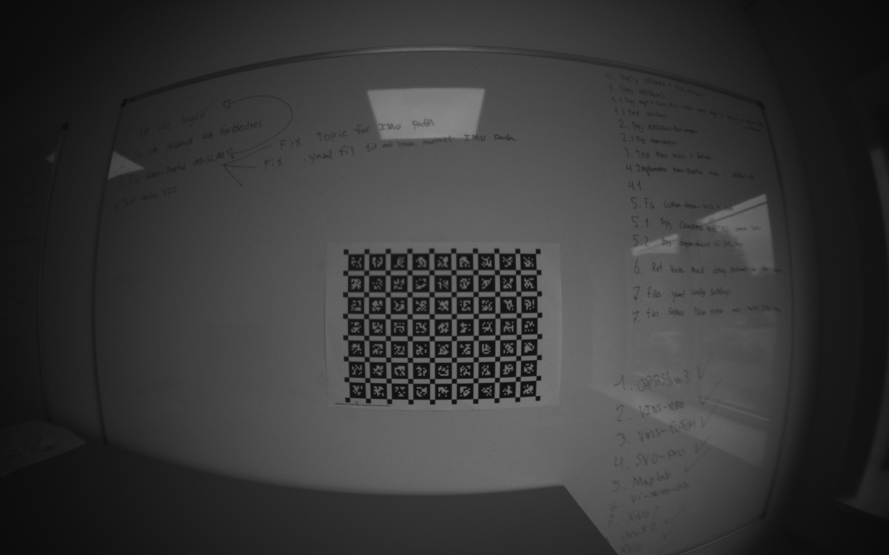

## Page 16

Comparison of Odometry
6
SYSTEM SETUP AND CONFIGURATION
derived from the calibration process, can be seen in the attachments. Figure 7 illustrates the calibration
errors encountered during the process. Overall, the result is pretty good, indicating a successful calibration
with only a few outliers.
(a) Camera calibration error.
(b) IMU calibration error.
Figure 5: PX4 drone calibration error results.
Each VIO method requires a calibration YAML file, but since their formats vary slightly, we had to man-
ually input the calibration parameters into each VIO method’s configuration files. You can find the final
configuration files we used for testing here: [config files].
6.4
Recording the AUDrone dataset
We recorded the dataset in the AU Air lab in Skejby. We needed to have our supervisor Andriy with us, as
a lot of the functionality and systems required to collect a full dataset, that satisfies our requirements, were
a bit complicated.
12

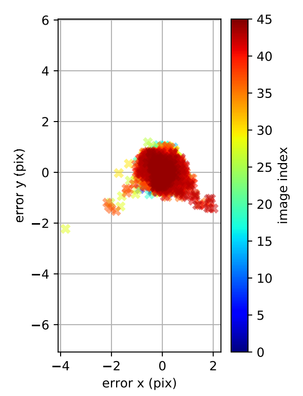

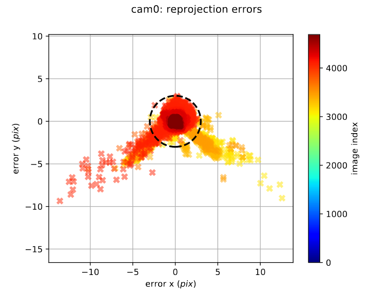

## Page 17

Comparison of Odometry
6
SYSTEM SETUP AND CONFIGURATION
First step was preparing the flight arena.
Figure 6: AU Air Lab, flight arena.
Each of the cameras needed to be calibrated using an infrared wand to tell the cameras, where they are in
relation to each other. This needed to be done every time the tracking system is used, as the aluminum
frame of the arena can bend and warp a bit with the changes in temperature, moving the cameras slightly.
(a) VICON system cali-
bration tracking wand.
(b) VICON tracking camera.
Figure 7: VICON camera calibration process.
Next, retro-reflective tracking balls were applied to the drone.
These are crucial for accurate location
triangulation, as they allow several cameras to track the drone by reflecting light back to the camera sensors.
13

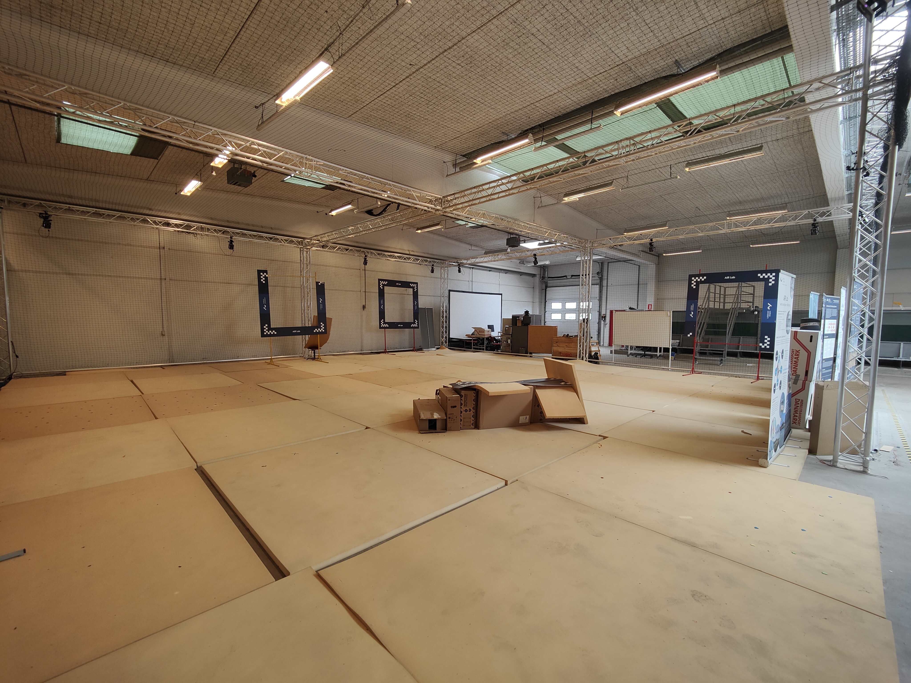

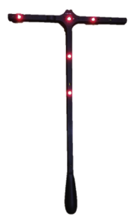

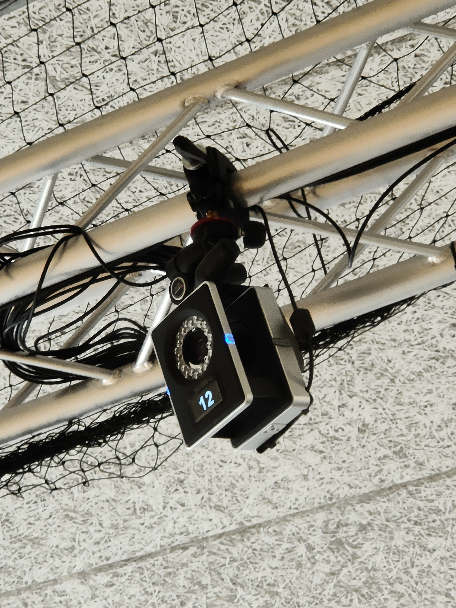

## Page 18

Comparison of Odometry
6
SYSTEM SETUP AND CONFIGURATION
Figure 8: Drone with attached reflective tracking balls.
Lastly came the step of using the Vicon tracker software. The data was recorded locally on the drone, using
a terminal over the network to start the recording. It was recorded as a ros2 bag, since the VICON software
also ran on ros2, allowing for automatic time synchronization. The groundtruth pose data from the VICON
software was also exported as a ros2 bag. So the two bags had to be converted into a single bag and then
into the other two formats; ros1 bag and EuRoC-MAV.
14

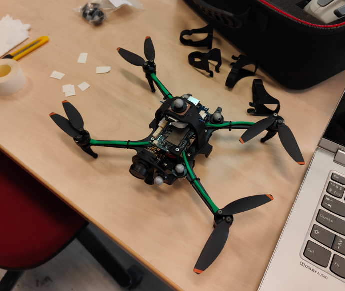

## Page 19

Comparison of Odometry
7
TESTING
7
Testing
To test the different VIO methods, we will first look at a controlled and widely used dataset ”EuRoC-
MAV”[1], which contains a set of 11 drone flights with varying combinations of slow startup, slow movement,
bright lighting, fast startup, fast movement, and dark lighting. The datasets are made based on two very
different scenarios, one being a ”Machine Hall” with lots of industrial equipment, big structures, and open
space. The other scenario ”Vicon Room” is a small room with loads of small items, structures, and furniture.
The data set also contains a ground-truth evaluation with a combination of Vicon motion capture system (6D
pose), a Leica MS50 laser tracker (3D position) and a Leica MS50 3D structure scan, making the evaluation
process extremely accurate and easy.
7.1
AU drone
At last we’ve conducted our own test in the AU Air lab. The drone data was exported into a ROS2 bag and
we captured the drone flight with a PX4 autonomy developer kit.
The use of the AU drone bag will generally follow and be added on to the remaining 11 bags. But there are
some extra steps that was necessarry for utilizing the drones bag for testing out our VIO programs. The
programs are already very familar with the EuRoC-MAV dataset, which means all of them come with a form
of YAML file already describing relevant information about the drone, camera and IMU calibration as well
as relative position of any of the things in relation to each other, like the TBC: Matrix. For most of these
programs their own version of such a YAML file has been choosen, as it must be the most suitable, without
further extensive research into every single program and the dataset, to potentially make slightly better
altered versions. Not all of the programs share the same structures for how such YAML files are written, so
faith was given to the authors of each of the programs, that they had made a sufficiently good enough file.
The issue now was, to find a way for us to utilize the calibration metrics we calculated with tests and convert
all of that into about 11 different yaml files and configurations. While certain characteristics were for the
most part kept the same as their EuRoC-MAV yaml versions, like internal program functionality, all of the
other information had to be tailored to our specific drone setup.
Alongside this another program had to be written, which combines PX4 rostopics from the drone at runtime,
to spit out a combined IMU topic that could be fed to most of the programs, this was the IMU Combiner
talked about in the previous section.
7.2
Evaluation Metrics
To ensure fair and consistent benchmarking across all tested VIO methods, experiments were conducted in
virtualized environments using VMware Workstation. Each VIO method was run inside an Ubuntu virtual
machine (Ubuntu 16.04, 18.04, 20.04, or 22.04 LTS), depending on the system’s compatibility. All virtual
machines were provisioned with 16 GB of RAM and 12 virtual CPU cores and executed on the same host
machine: an ASUS ROG Zephyrus G14 equipped with an AMD Ryzen 9 5900HS processor.
We evaluated each method using two main categories of metrics:
• Accuracy: Measured using Absolute Trajectory Error (ATE), comparing the estimated trajectory
against the ground truth provided in the EuRoC-MAV dataset[1]. Specifically, we compute the Mean
Absolute Error (MAE) of the translational components after aligning trajectories using a rigid-body
transformation. This metric reflects the global consistency and drift of the estimated trajectory.
• Performance: Quantified by monitoring average CPU and RAM usage throughout each run. CPU
usage is reported as the percentage of total virtual cores utilized (12 cores), and memory usage is
expressed as the percentage of 16 GB RAM consumed. These measurements give insight into the
computational efficiency and resource requirements of each method.
By combining these metrics, we aim to assess both the effectiveness and efficiency of each VIO method,
providing a practical perspective for applications with limited computational resources, such as real-time
deployment on aerial drones.
15

## Page 20

Comparison of Odometry
7
TESTING
7.3
Testing Procedure and Reproducibility
The testing procedure is simple, run the software and all its dependencies as described in their Github
repositories, monitor its usage with a logger script and close everything after a successful run.
Nearly
all scripts follow this format, however some require special nuances and more attention from the user to
successfully gather the relevant information and or complete the run, usually as a result of the program
not giving a useful code indicating normal termination, crashing or other other relevant factors that would
otherwise be necessarry to determine a run being ”successful” via software. For this we used alternative
measures, like monitoring that the program ID was still running and the bag finished to start closing it down.
7.3.1
Automation of programs on all 11 bags
The first part of the testing process was automating the running of the programs, logging and retrying on
failed attempts with scripts. So for this, the scripts run all euroc ”programname”.sh,
log resources ”programname”.sh and run all AUDRONE ”programname”.sh, were made, which can be found
here: [Program and log Scripts]
The functionality of the scripts are quite simple, first off each logging script, simply uses in built linux
commands like ”top” to get and then echo out the current memory and cpu usage in percentage into a log
file with an appropriate name and at a rough 1 second interval.
The runner scripts, usually starts out with some form of path setups to the logger scripts, the program
specific path on the vm and their startup commands and files, the path to the specific versions of the
datasets (ros1, ros2 or euroc), that the program needs to run it on and any other relevant or individual
paths for that specific program. Such individual cases could be alternative trajectory file generation and
conversion scripts, cause the program doesn´t automatically make one.
This is followed up by a quick sourcing of the setup.bash file, that each program usually generates after
succesfully building it. Afterwards it has some form of a launch command that is specified on each programs
individual github repository. Lastly the whole ”running” part of the script happens. For all the folders,
that contains our bags, it launches both the program command, then the logger command and the bags
and takes note of each of their processor id´s, it then monitors for a successfull exit of the program to then
determine when to either move the generated trajectory and logging files or whether to close down all its
stored processor ids and retry running it again.
As a sidenote, the way retrying is caught is usually determined by whether a crash signal was sent by the
program or a trajectory file was generated by it. However all programs work quite differently so sometimes
program specific solutions had to be made to retrieve a similar result.
7.3.2
Automation of trajectory data conversion
After successfully generating trajectories for all programs, the process of converting the data to a specific
format known as ”TUM” is next. This step is vital because it is required for the evaluation program we have
chosen, called EVO[14], but more about that in the following section.
So more automation scrips needed to be made, which could take care of the process of turning widely differing
.csv files into our needed ”TUM” text files.
The process is again very similar for all scripts, however differ a bit depending on each programs specific
way of logging down trajectory information, some like to add a lot of additional information and some only
the requide, there are even programs like ORBSLAM3, which has a feature to export the trajectory directly
in that format.
The script convert all to tum.py specifies and runs all the actual conversion script with the paths to find
the related trajectory files and the specific names for each variant. The conversion script variants all follow
the name convert ”programname” tum.py and inside of it, it specifies which columns to keep from the CSV
and reorganizes it in the ”TUM” format, which looks as such (timestamp, tx, ty, tz, qx, qy, qz, qw), where
ty,tz,qx is the 3D translation in meters and the qy, qz, qw is the unit quaternion representing rotation, where
qw is the scalar part. Those scripts can be found here: [Conversion Scripts]
16

## Page 21

Comparison of Odometry
7
TESTING
7.3.3
Automation of Evo evaluation with the groundtruths
After collecting and subsequently converting the data, we lastly need to evaluate the data’s accuracy in
comparison to our groundtruths using the EVO program[14].
For this a singular automation script was created with the name Evaluate All Program On Datasets.py.
The script sets up two different structures, our first structure is our dataset structure, which simply tells us
which folder names that our script is looking for (mh-01..., v1-01... etc). The next is the methods structure,
which specifies 4 things, name, folder, file and log file. Name is simply the name of the method it will use
to make the result easily connectable to the program. Folder specifies, in which of the three underlying
folders ros1bags, ros2bags or eurocmavformat, should we look. File specifies which trajectory file name we
are looking for and log file specifies, which log file.
Then the script loops through and searches our whole repository for folders that match our specified methods
and if any of the named ones are found, it evaluates those method´s trajectory files to the equivalent dataset´s
groundtruth.
EVO then spits out a short result table of mae (we modified EVO to give this metric specifically), max,
mean, median, min, rmse, sse and std. These are all transferred alongside the log files information, where
the average of cpu and ram percentage over all the points are calculated and all of these data points are put
into a single line in a csv file, by the name of [evo ape all results.csv]. With that csv file, our whole testing
phase is done and ready for comparison.
7.3.4
Guaranteeing fairness
To guarantee that there isn’t a massive issue with our code, that was related solely to our implementation
of the mono inertial mode, we managed to find some forks of the project, which contained similar but
more bare bones implementation of the mono inertial mode. So i added two additional mono-inertial node
implementations to our fork, by the name of mono-inertial-node2 and mono-inertial-node3, which can be
found here with their accompanying original repo references[Mono-inertial-node2] [15] and [Mono-inertial-
node3][16]. Otherwise they seemlessly mimic the testing of our orbslam3 implementation and minor additions
were added to some of the scripts to now also include a run of each of these.
Additionally since several of the softwares needed to have some additional help with skipping several seconds
into the dataset, we made an additional script trim, where we cut a specified amount of seconds into the
trajectory files, based on the timestamps and save them as different trajectory files with a trim added.
This is to remove as much of the initialization flights and still drone footage as possible, meaning that these
versions, should only have the trajectory for the actual flight itself for all programs on all the datsets.
With these trimmed version a copy of our evaluation script found here Evaluate All Program On Datasets Trim.py
was made that makes the trimmed csv version evo ape all results trim.csv
17

## Page 22

Comparison of Odometry
8
RESULTS
8
Results
By utilizing the tool Evo[14], we got a plethora of results as discussed in the previous testing part, here we
will solely focus on the combined MAE score and memory + cpu usage. If interested the full results, they
can be found here: [Full Results]
Otherwise we will outline any discrepancies and outliers that are relevant in the part below.
8.1
Accuracy
To compare the MAE scores we compiled the resulting values in table 3. The highlighted scores are extreme
outliers.
Dataset
Program
ORB-SLAM3
ORB-SLAM3 2
ORB-SLAM3 3
Vins-Mono
Vins-Fusion
SVO-PRO
Maplab
VI-DSO
OKVIS2
RVIO
Kimera
MH 01 easy
0.080
0.043
0.078
0.145
0.155
0.084
0.170
0.089
0.003
0.760
0.390
MH 02 easy
34.915
528.601 171.783 0.134
0.072
0.056
0.298
0.083
0.027
0.159
0.162
MH 03 medium
0.048
0.045
0.046
0.171
0.158
1.308
0.341
0.667
0.077
0.727
0.317
MH 04 difficult
4.619
DNF
DNF
0.331
0.191
0.158
0.343
0.851
0.204
0.280
0.765
MH 05 difficult
0.124
0.074
0.056
0.296
0.348
0.195
0.566
0.092
0.084
0.457
3.897
V1 01 easy
0.100
0.099
0.097
0.079
0.058
0.171
0.090
0.179
0.082
0.129
4.950
V1 02 medium
0.078
0.080
0.073
0.099
0.217
0.086
0.132
37.654
0.039
0.166
0.132
V1 03 difficult
0.068
0.058
0.054
0.167
0.147
0.082
0.129
9.307
0.069
0.163
0.137
V2 01 easy
0.057
0.918
1.606
0.071
0.095
0.087
0.122
0.232
0.107
0.134
0.137
V2 02 medium
2.978
0.381
0.529
0.138
0.134
0.088
0.135
0.194
0.062
0.235
0.189
V2 03 difficult
552.223 303.291 30.058
0.242
0.150
0.148
0.155
0.200
0.460
0.342
0.445
AUDrone1
0.142
0.209
N/A
N/A
N/A
N/A
N/A
N/A
N/A
N/A
N/A
AUDrone2
0.143
0.125
N/A
N/A
N/A
N/A
N/A
N/A
N/A
N/A
N/A
AUDrone3
0.761
1.528
N/A
N/A
N/A
N/A
N/A
N/A
N/A
N/A
N/A
Realtime
0.3-
0.5
0.3
0.3
0.5
0.5
1.0
1.0
0.73
1.0
0.5
0.5
Skip Init
NO
NO
NO
NO
YES
1
YES
3
NO
YES
2
NO
YES
3
YES
4
Average
54.117
83.359
20.438
0.170
0.157
0.224
0.226
4.504
0.110
0.323
1.047
w/o outliers
0.079
0.212
0.133
0.170
0.157
0.116
0.226
0.287
0.110
0.323
0.297
Table 3: Benchmark results: Monocular VIO-methods measured accuracy (MAE score [m]) on
multiple different dataset collections. Each cell reports the mean absolute error (MAE) score
for the corresponding method on a specific dataset. Two additional columns, ORB-SLAM3 2
and ORB-SLAM3 3 represent the other implementations from Github. The last four rows
summarize special conditions: Realtime reports whether it needed slowed down playback or
not 1.0 for normal speed 0.5 for half, Skip Init specifies if the method needed skipping some
part of the early initialization portion of a dataset to even get a reasonable result. Average
shows the average accuracy across all runs without the AUDrone results, for each method and
w/o outliers is the average accuracy of for all runs and removing any above 1.0 MAE, which
are marked in red. DNF is Did not finish, N/A is not enough time to prepare the testing for
AUDrone on the systems.
Why some AUDrone results are missing.
While the EuRoC-MAV dataset allows for a comprehensive comparative analysis across multiple VIO meth-
ods, time constraints prevented the successful implementation and testing of every algorithm on our custom
dataset. Consequently, only ORB-SLAM3 was successfully integrated and validated on the dataset.
18

## Page 23

Comparison of Odometry
8
RESULTS
Figure 9: Boxplot showcasing the performance metrics of the different vio methods on the normal trajectory
files.
Dataset
Program
ORB-SLAM3
ORB-SLAM3 2
ORB-SLAM3 3
Vins-Mono
Vins-Fusion
SVO-PRO
Maplab
VI-DSO
OKVIS2
RVIO
Kimera
MH 01 easy
0.079
0.043
0.078
0.124
0.117
0.091
0.192
0.061
0.003
0.357
0.313
MH 02 easy
34.915
528.601 172.812 0.156
0.091
0.069
0.245
0.073
0.058
0.159
0.140
MH 03 medium
0.048
0.046
0.046
0.171
0.144
0.186
0.293
0.667
0.092
0.629
0.286
MH 04 difficult
4.619
DNF
DNF
0.305
0.173
0.158
0.271
0.886
0.209
0.280
0.771
MH 05 difficult
0.125
0.074
0.056
0.275
0.293
0.188
0.502
0.098
0.115
0.438
3.372
V1 01 easy
0.100
0.099
0.097
0.079
0.058
0.171
0.090
0.179
0.081
0.129
4.982
V1 02 medium
0.078
0.080
0.073
0.099
0.217
0.086
0.132
37.654
0.039
0.166
0.132
V1 03 difficult
0.068
0.058
0.054
0.167
0.147
0.082
0.127
9.307
0.071
0.162
0.136
V2 01 easy
0.057
0.918
1.606
0.071
0.095
0.087
0.118
0.232
0.107
0.134
0.135
V2 02 medium
2.978
0.381
0.529
0.138
0.134
0.088
0.136
0.194
0.062
0.235
0.188
V2 03 difficult
552.223 303.291 30.058
0.242
0.150
0.148
0.156
0.200
0.472
0.341
0.442
Average
54.117
83.359
20.541
0.166
0.147
0.123
0.206
4.505
0.119
0.275
0.991
w/o outliers
0.079
0.212
0.133
0.166
0.147
0.123
0.206
0.288
0.119
0.275
0.282
Table 4: Benchmark results: Monocular VIO-methods measured accuracy (MAE score) on the
trimmed version of the datasets. Identical to 3, except we took a couple of redundant rows out,
like AUDrone, Realtime and Skip Init. For this table it utilizes the trimmed trajectory results,
where we cut off as much of the run as possible, where the drone was simply stationary from
their trajectory file, meaning it should now only give us the actual value of how accurate the
measured trajectory is to the actual flight itself. DNF is Did not finish.
19

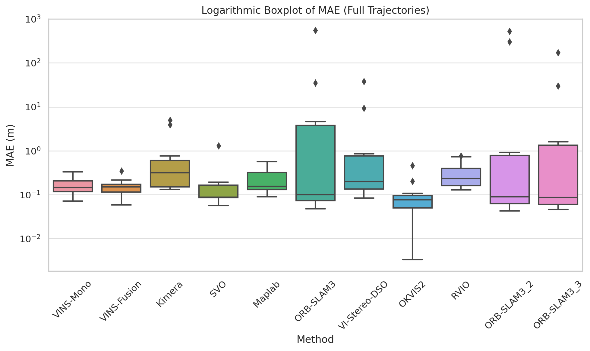

## Page 24

Comparison of Odometry
8
RESULTS
Figure 10: Boxplot showcasing the performance metrics of the different vio methods on the trimmed trajec-
tory files.
While the results of the tested programs vary significantly in overall performance, some clear winners emerged
across all 11 datasets. In terms of accuracy, OKVIS2 stands out as the top performer. When it comes to
robustness and ease of use—defined by the ability to run without special configuration or manual inter-
vention—OKVIS2 and Maplab are the clear leaders. Both systems processed the full dataset using default
settings and delivered consistently strong results without requiring external help.
In contrast, the remaining methods needed varying levels of manual adjustment or workarounds to produce
reliable outputs. The breakdown is as follows:
Kimera required intervention on four datasets and still struggled to achieve competitive accuracy, even with
extensive tuning.
ORB-SLAM3, RVIO, and SVO-PRO each required assistance with three datasets, with mixed results de-
pending on the scenario.
VI-Stereo-DSO needed help with two datasets, but even then, it was difficult to tune it to perform well on
the outliers.
VINS-Fusion needed minor help with only one dataset and performed admirably overall.
When we consider the results in “w/o outliers”, our own implementation of ORB-SLAM3 emerges as the
most accurate across the seven datasets it handled well. However, this performance still excludes four failed
runs, which we believe stem from suboptimal settings or implementation errors. Once those problematic
cases are omitted, all methods show more comparable performance, with MAE scores ranging between 0.079
and 0.323, suggesting that proper tuning or configuration could bring most methods within a similar accuracy
range.
20

## Page 25

Comparison of Odometry
8
RESULTS
What does “help” mean in this context?
In practice, many methods struggled on some datasets without manual intervention. Simply re-running
these datasets rarely improved the outcome—outliers would often produce MAE scores ranging from 50 up
to 10,000+, showing severe trajectory drift.
To address these issues and help more methods succeed, we applied two simple techniques:
Playback Rate Adjustment: Slowing down the bag playback (typically to 0.5× speed) reduces the processing
load and improves frame-by-frame stability. This was especially helpful for methods that struggled with
real-time input rates.
Skipping Initialization: By using a skip flag (e.g., -s 25), we ignored the early parts of the bag that often
included static initialization or non-representative flight behavior. Programs like RVIO benefited significantly
from this, especially on MH 01 and MH 02, which required 25–35 seconds of skipping. MH 03 and MH 05
needed shorter skips (around 9–15s), while some V1 and V2 bags improved with minor skips of 1–4s.
Trimmed Results
In the “trimmed” configuration, we applied dataset-specific skip values (from 0 to 45 seconds) uniformly to
all methods. This allowed us to isolate the main flight segments and reduce any initialization-related bias.
While some methods already cut this data internally (e.g., ORB-SLAM3 variants showed no change), others
improved slightly—or in rare cases, worsened.
The net effect on conclusions was minimal, though one notable change occurred: SVO-PRO now matches
OKVIS2 almost identically, with a mere 0.004m difference in the average MAE. Still, it’s important to note
that SVO-PRO needed more manual intervention than OKVIS2, which remains the more robust plug-and-
play solution overall.
21

## Page 26

Comparison of Odometry
8
RESULTS
8.2
Resource Usage
To compare the VIO methods we also have to look at computational and memory usage. Table 5 is expanded
to include both CPU and memory(RAM) usage. Both of these metrics are in measured in units of [%] of the
maximum available resource. The CPU metric is average % usage of 12 virtual cores on a ryzen 9 5900HS
and the RAM metric is average % usage of 16GB of RAM. A lower score is better, indicating a more efficient
algorithm.
Table 5: Benchmark results: Monocular VIO-methods measured CPU and memory usage on
multiple different dataset collections. NOTE:RVIO is 0 some places, cause the result is rounded
down.
Dataset
Program
ORB-SLAM3
ORB-SLAM3 2
ORB-SLAM3 3
Vins-Mono
Vins-Fusion
SVO-PRO
Maplab
VI-DSO
OKVIS2
RVIO
Kimera
MH 01 easy
CPU:
RAM:
14%
17%
8%
23%
8%
22%
2%
18%
1%
12%
3%
13%
2%
14%
15%
10%
29%
42%
1%
20%
9%
77%
MH 02 easy
CPU:
RAM:
11%
17%
4%
17%
6%
18%
2%
18%
1%
12%
4%
13%
2%
13%
15%
12%
38%
45%
1%
42%
9%
77%
MH 03 medium
CPU:
RAM:
14%
18%
6%
17%
6%
17%
2%
18%
1%
12%
2%
13%
2%
13%
16%
11%
51%
49%
0%
9%
5%
78%
MH 04 difficult
CPU:
RAM:
15%
14%
N/A
N/A
N/A
N/A
2%
17%
1%
12%
3%
13%
2%
12%
17%
10%
22%
55%
1%
15%
9%
77%
MH 05 difficult
CPU:
RAM:
14%
17%
7%
22%
7%
15%
2%
17%
1%
12%
4%
13%
2%
13%
16%
13%
58%
64%
0%
9%
5%
77%
V1 01 easy
CPU:
RAM:
14%
17%
8%
22%
8%
15%
2%
18%
1%
12%
4%
13%
2%
13%
16%
13%
37%
66%
0%
10%
6%
77%
V1 02 medium
CPU:
RAM:
14%
16%
8%
21%
8%
15%
2%
17%
1%
12%
4%
13%
3%
12%
13%
14%
31%
69%
0%
8%
6%
77%
V1 03 difficult
CPU:
RAM:
13%
17%
8%
22%
8%
15%
2%
17%
1%
12%
4%
13%
3%
12%
13%
14%
27%
72%
0%
9%
5%
77%
V2 01 easy
CPU:
RAM:
13%
17%
8%
22%
8%
15%
2%
17%
1%
12%
4%
13%
3%
13%
15%
13%
22%
75%
0%
9%
6%
77%
V2 02 medium
CPU:
RAM:
14%
17%
9%
22%
8%
16%
2%
17%
1%
42%
3%
12%
3%
12%
16%
12%
20%
77%
0%
9%
5%
77%
V2 03 difficult
CPU:
RAM:
23%
15%
5%
14%
6%
16%
2%
17%
1%
12%
5%
13%
3%
12%
16%
13%
20%
81%
0%
9%
5%
77%
Average
CPU:
RAM:
15%
16%
7%
20%
7%
16%
2%
17%
1%
14%
4%
13%
2%
13%
15%
12%
32%
63%
0%
14%
6%
77%
22

## Page 27

Comparison of Odometry
8
RESULTS
Figure 11: Graph showcasing the average cpu and ram usage in percentage per method. NOTE: RVIO is
at 0% because the result is rounded down from 0.3%.
While there was a clear winner in terms of accuracy, the results for resource usage (CPU and RAM) tell a
different story. When comparing computational efficiency, VINS-Fusion, VINS-Mono, RVIO, and Maplab
all perform similarly, with RVIO narrowly leading the group—recording the lowest CPU usage and only 14%
RAM on average.
At the opposite end of the spectrum, OKVIS2 showed the highest resource usage, averaging 32% CPU and
63% RAM, while Kimera had relatively low CPU usage (6%) but the highest RAM usage at 77%.
Our own ORB-SLAM3 mono-inertial implementation performed moderately in terms of efficiency. However,
compared to the two other ORB-SLAM3 variants, it consumed nearly twice the CPU, suggesting that our
implementation may benefit from further tuning and optimizations. With improvements, it could potentially
sit closer to the middle of the pack in terms of resource demands, while retaining its competitive accuracy.
Note: While all evaluated methods are capable of generating trajectory estimates, some incorporate addi-
tional, non-essential components that increase CPU and memory usage. These include dense or semi-dense
3D mapping, real-time visualization, map serialization, or background processes such as point cloud fusion
and loop-closure database maintenance. These features are typically useful in full SLAM or mapping pipelines
but are not required for pose estimation alone. Unfortunately, such components were not always possible to
disable—especially visualizations—due to how tightly they are integrated into the system architectures.
23

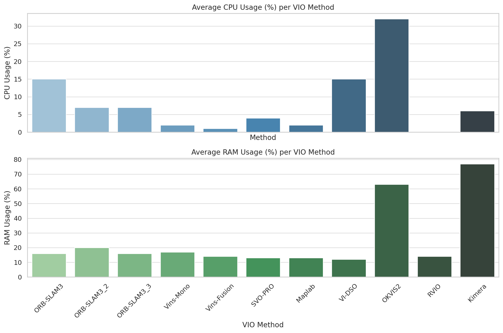

## Page 28

Comparison of Odometry
9
DISCUSSION
9
Discussion
9.1
Key Findings
Our results reveal that the most accurate VIO method is OKVIS2, closely followed by SVO-PRO, particularly
when their initialization periods are excluded from evaluation. So for high accuracy applications, we would
recommend using OKVIS2 or SVO-PRO. While both are very accurate, OKVIS2 uses the most computational
power of all the VIO’s, so that should be taken into consideration when selecting the VIO, in comparison
SVO-RRO only uses less than half the CPU power. In terms of computational efficiency, RVIO, Vins-Fusion,
Vins-Mono, and Maplab stand out, all exhibiting similar resource usage within a margin of two percent,
making them strong candidates for real-time and embedded applications. Among all evaluated methods,
Maplab emerges as the most balanced overall: it delivers strong accuracy, excellent resource efficiency, and,
notably, benefits from well-maintained documentation, an extensive wiki, and robust community support —
making it not only performant but also accessible and user-friendly.
Our evaluation also highlights the strong potential of ORB-SLAM3’s mono-inertial mode — both in our
implementation and in other publicly available variants. While our version demonstrates competitive accu-
racy, it currently lags in efficiency due to extensive debugging instrumentation and suboptimal tuning. If its
runtime configuration can be further optimized — ideally aligning with the more efficient implementations
— and made robust enough to handle the full dataset without manual intervention, ORB-SLAM3 could
emerge as the most accurate overall method. Moreover, such improvements could position it as a more
resource-efficient alternative to similarly performing systems.
9.2
Strengths and Weaknesses of Evaluated VIOs
Generally it can be said that all VIO methods do a decent job at tracking most of the dataset. However
there were some general trends in strength and weaknesses.
Strengths:
Nearly all systems has very reasonable resource usages, indicating that a lower power and core count CPU
would probably be enough to run them, which is great for any future drones that might wanna work with
such software onboard the drone in real time.
Their best case results are very accurate, while some programs had problems with a couple of bags, the
overall result was still that all programs gave a result far below one meter MAE for around seventy to
around one hundred percent of the time, depending on which software.
Weaknesses:
While the best case results were great, the overall stability and reproducibility is not. Again except for a
few programs, most of them had some form of issue with a bag consistently and several had unexplainable
issues with random bags, that weren’t always easily discernible or recreational.
Unfortunately, the VIO methods lack user-friendliness and provide a poor user experience. Although the
programs deliver the intended results, a significant problem arises from the extensive effort required—either
by diving into the code or scouring online forums to resolve issues. Even so much as simply having an easily
explained summary of certain settings and functionality would do wonders for an basic understanding of
these programs, without having to dig deep into them learning how to make them work.
9.3
Challenges Encountered During Research
Multiple of the VIO systems suffer from being outdated or deprecated. Additionally, many suffer from incon-
sistent or poorly documented installation processes and explanations. Instead of detailing the installation
process of every single VIO system, we will list the most common faults and tripping points that happened
during the setup process:
Incorrect versions of third party dependencies: By far the most annoying error to fix, cause while the solution
is simple, it isn’t easy to find out if this is the cause of your problem or something different, as you will usually
24

## Page 29

Comparison of Odometry
9
DISCUSSION
be hit with hundreds of errors and deprecated functions. Your best bet is to try and find out if a post has
been made specifying it to be the case, as the only fix is to either go into what ever thirdparty dependencies
folders and git checkout a commit that was within the timerange of the vio programs life cycle, here google
and AI chats can really help you narrow down timeframes quite a lot faster than manually guessing.
Cmakelists errors: Common problem, that can be easy to fix once you start learning more about the
cmakeslist file, but the error types aren’t as easily understandable and easy to fix as other errors. Ususally
you need to manually add in some form of include dir or remove them, because either you forgot to sudo
make install or the automated install process that the vio program ran didn’t manage to do it properly
either.
Cmake wrong version: Either Cmake is updated on your system, the vm you are running or it was just not
run with such a version available at the time the program was made. These errors are problematic, leading
either to trying to reinstall a whole new version of Cmake, which is a huge issue if you have several different
VIO systems on one computer or VM. The best advice for tackling these is start with a fresh VM of exactly
the version that the guide used or specified and then hope it has the cmake version you need and if not
downgrade/upgrade it.
Deprecated or newer versions of functions and their use: These are quite common, program relies on using
some functions that have now been deprecated and you need to manually change them to the updated ones,
they are quite easily understandable and therefore easily fixable for the most part.
Another huge problem that one will encounter with the VIO systems, is both their error logs and their crash
reports. Generally the programs will say tracking lost, map lost, restarting and much more, these might
sound good on the surface, but since there is no specifying exactly what it is that is causing the issue, it will
be hard to fix these issues.
Another problem that was extremely frustrating was specifically while setting up ORBSLAM3 was Sophus
NAN errors. Especially one known in expandtheta(). Such an error caused lots of work trying to debug
exactly what in the code was causing them to happen. This is the reason why our mono-inertial mode
implementation has so much debugging and message cleanup, which hurts the resource usage quite a bit.
Later on it was deduced, that it was more likely related to the PX4 drone bags IMU readings, duplicated
entries, too old or new IMU measurements and likely even the camera and drone calibration extrinsics.
Overall they are good things to now monitor for and clean with the use of the code, but it also meant that
a lot of time was spend wastefully focusing on this aspect first, when it could have been saved for later,
since a lot of NAN errors can be attributed to bad bag recordings, drone IMU inconsistencies and camera
calibrations and their accompanying yaml files.
9.4
Limitations of the Study
This study is not an overall perfect study of the exact stability and performance of every program in a
vacuum. Because of the nature of VM’s and the extensive testing pipeline and structure setup, there is
no guarantee, that every program on this list will fare this well every time you try it, even if you replicate
our exact settings. But given enough attempts and tries, it should be possible to replicate a similar result
to ours at least with a best case scenario. It also hasn’t in depth studied and played around with every
intricate setting available for all nine of the VIO systems, while ORBSLAM3 is by far the most tinkered with
program, even here it would be beneficial to try and test every single bag with varying program settings, as
even though our actual bags scenario flights vary quite a bit, our intricate program parameters do not and
some of them supposedly should help a lot with those varying conditions.
Our comparative analysis primarily relied on the EuRoC-MAV dataset. While this dataset proved invaluable
for broad evaluation, time constraints unfortunately limited our ability to integrate and test every algorithm
on our own custom dataset. Consequently, ORB-SLAM3 was the only VIO method successfully implemented
and validated on our data. This confirmed that our custom dataset is suitable for VIO testing, but it also
meant that cross-method comparisons were exclusively confined to the EuRoC-MAV benchmark.
25

## Page 30

Comparison of Odometry
9
DISCUSSION
9.5
Lessons Learned
It saddens us that we couldn´t get all the VIO methods tested on the AUDrone dataset, but the fact that
our own ORBSLAM3 implementation works on all 3 recordings, proves that we are now successfully able to
record varying degrees of difficult drone datasets, that we can calibrate and analyze such datasets on our
own, when recordings couldn´t even run beforehand.
While our results showcase the overall expected performance and accuracy one can get as a relative newcomer
with just minimal setup, knowledge and experience, it sadly falls short of dialing in every single VIO method
intrinsically, both with their internal parameters, but also additional feature testing and relative dataset
parameters.
Had our study been more thorough and had significantly more time, it would most likely
have been possible to try and make this whole testing setup one hundred percent automated. Starting up
individual virtual machines, logging in, prepping the shared data folder and running the tests scripts. From
there it would have been possible to add both more extensive testing of all manners of these parameters. Lets
use ORBSLAM3 as an example, we could test parameters like playback rate of the bag from 0.1-1.0, skipping
anywhere from plus or minus 5 seconds from a determined standstill point in each individual dataset. Trying
to get at least 5 successful results and only allow it to crash 5 times at any settings combination and then
lastly we could try and mess around with the orb extractor intrinsic features of orbslam3:
ORBextractor.nFeatures: 1000 (could range 100-2000)
ORBextractor.scaleFactor: 1.2 (could range 0.8-1.4)
ORBextractor.nLevels: 8 (could range 6-12)
ORBextractor.iniThFAST: 20 (could range 15-25)
ORBextractor.minThFAST: 7 (could range 5-9)
While this would be the ideal ultimate testing scenario, even if we limited it to three different values for all
of the categories and wanted to run the configuration 5 times at each setting, you are looking at a total of 37
= 2.187 combinations x 5 runs for a total of 10.935 runs of every single dataset. With an average length of
about 2 minutes that would be nearly ∼22.000 minutes of testing per singular dataset per program and not
even accounting for the increased time it takes when we slow the bags down. While this ’grid search’ like
approach would be ideal for testing all possible configurations of the VIOs, it proves impractical doing brute
force, which is why we went with individually tuning the VIO methods or using the configuration given by
the author.
So what have we actually learned from this? Well a lot in fact. Firstly we have learned that while VIO
systems are out there which do a good job at performing the pose estimation. Most of them are still far
behind what most would consider ”professional” standards, when it comes to userability, user friendliness,
stability and ease of use and installation process. It dosen’t seem like the field of VIO is quite mature. They
are quite advanced, some are quite efficient and they all get the job done, when you take your time to know
and use them.
Secondly we have learned, that not everything is just up to the VIO’s themselves, while in the future the
programs might become so advanced that they can handle and filter out bad data in datasets at runtime,
sadly it still relies heavily on datasets, which is well constructed and meticulously calibrated. It is also
undoubtedly going to always be an issue for these softwares, simply how much calibration is needed and
how well it’s done. Hopefully one day, there will be some more dynamic and automated tests that can be
done with the use of such advanced software of the future, to make the whole system feel that much more
user-friendly.
Lastly, while our testing framework and results are far from perfect, they give a good reference frame or basis
to take from, to further work towards a goal of a more robust and automated testing framework analyzing
several different VIO methods and systems.
26

## Page 31

Comparison of Odometry
10
CONCLUSION
10
Conclusion
This benchmark set out to evaluate a wide array of monocular VIO systems using a common testing pipeline
applied across the EuRoC and AUDrone datasets.
By comparing 11 VIO implementations using both
trajectory accuracy and system resource usage, we aimed to identify strengths, weaknesses, and practical
considerations relevant for real-world deployment.
While the results showed significant variance in out-of-the-box performance, a few systems stood out clearly.
OKVIS2 and Maplab not only achieved high accuracy but did so with minimal configuration and a high
degree of robustness across all datasets. In contrast, other systems — including RVIO, Kimera, and our own
ORB-SLAM3 variant — required varying degrees of manual intervention (e.g., adjusting playback rate or
skipping unstable initialization periods) to produce viable results.
Yet, once problematic runs were removed or rectified, many systems fell within a very close accuracy range,
with Mean Absolute Errors (MAE) between 0.079m and 0.323m.
Notably, our modified ORB-SLAM3
implementation emerged as the most accurate among the systems that succeeded on seven or more datasets.
While its higher CPU usage may be attributed to additional debugging and logging infrastructure, this
highlights ORB-SLAM3’s potential if further optimized.
However, the process also exposed broader issues in the VIO ecosystem: user experience remains poor,
documentation is inconsistent, and the burden of fine-tuning often falls heavily on the user. Factors like
undocumented dependencies, cryptic configuration parameters, and vague error reporting complicate the
process of deploying even well-established frameworks. This is a significant barrier for practitioners aiming
to integrate these systems into production environments or resource-constrained platforms.
In addition, many VIO systems include tightly coupled modules for dense mapping, loop closure, or visu-
alization — components that are not essential for pose estimation but still consume significant CPU and
memory. While we disabled visualization where possible, we could not always isolate VIO from SLAM-related
processes, making resource comparisons inherently skewed in some cases.
Looking forward, our results suggest that with proper configuration, most modern VIO systems are capable
of highly accurate pose estimation. However, the trade-off between configurability, robustness, and com-
putational efficiency remains a core challenge. Given this, we plan to continue refining and benchmarking
ORB-SLAM3, not only because of its high potential, but also to better understand how algorithmic tuning
and system modularity can push it toward both accuracy and efficiency.
Ultimately, this project lays a foundation for more systematic, reproducible benchmarking in the VIO field —
and emphasizes the need for frameworks that are not just precise, but practical, predictable, and accessible
to those deploying them in the real world.
27

## Page 32

Comparison of Odometry
REFERENCES
References
[1]
M. Burri - J. Nikolic - P. Gohl - T. Schneider - J. Rehder - S. Omari - M. Achtelik - R. Siegwart. The
EuRoC micro aerial vehicle datasets, International Journal of Robotic Research. Last visited: 04-02-
2025. https://projects.asl.ethz.ch/datasets/doku.php?id=kmavvisualinertialdatasets.
[2]
OpenCV. OpenCV - Feature Detection and Description. Last visited: 21-05-2025. https://docs.
opencv.org/4.x/db/d27/tutorial_py_table_of_contents_feature2d.html.
[3]
J. Engel - V. Koltun - D. Cremers - Jiaming Sun. VI-Stereo-DSO. Last visited: 19-05-2025. https:
//github.com/RonaldSun/VI-Stereo-DSO.
[4]
Zichao Zhang - Davide Scaramuzza. A Tutorial on Quantitative Trajectory Evaluation for Visual(-
Inertial) Odometry. Last visited: 20-05-2025. https://rpg.ifi.uzh.ch/docs/IROS18_Zhang.pdf.
[5]
Carlos Campos et al. ORB-SLAM3: An Accurate Open-Source Library for Visual, Visual-Inertial and
Multi-Map SLAM. Last visited: 19-05-2025. https://github.com/UZ-SLAMLab/ORB_SLAM3.
[6]
Tong Qin - Peiliang Li - Zhenfei Yang - Shaojie Shen. VINS-Mono A Robust and Versatile Monocular
Visual-Inertial State Estimator. Last visited: 19-05-2025. https://github.com/HKUST- Aerial-
Robotics/VINS-Mono.
[7]
Tong Qin - Shaozu Cao - Jie Pan - Peiliang Li - Shaojie Shen. VINS-Fusion An optimization-based multi-
sensor state estimator. Last visited: 19-05-2025. https://github.com/HKUST-Aerial-Robotics/
VINS-Fusion.
[8]
Christian Forster - Zichao Zhang - Michael Gassner - Manuel Werlberger - Davide Scaramuzza. SVO-
PRO: Semidirect Visual Odometry for Monocular and Multicamera Systems. Last visited: 19-05-2025.
https://github.com/uzh-rpg/rpg_svo_pro_open.
[9]
A. Cramariuc - L. Bernreiter - F. Tschopp - M. Fehr - V. Reijgwart - J. Nieto - R. Siegwart - C.
Cadena. maplab 2.0 – A Modular and Multi-Modal Mapping Framework. Last visited: 19-05-2025.
https://github.com/ethz-asl/maplab.
[10]
Stefan Leutenegger. OKVIS2: Open Keyframe-based Visual-Inertial SLAM. Last visited: 19-05-2025.
https://github.com/smartroboticslab/okvis2.
[11]
Huai Zheng - Huang Guoquan. R-VIO: Robocentric visual-inertial odometry. Last visited: 19-05-2025.
https://github.com/rpng/R-VIO.
[12]
Rosinol Antoni - Abate Marcus - Chang Yun - Carlone Luca. Kimera: an Open-Source Library for Real-
Time Metric-Semantic Localization and Mapping. Last visited: 19-05-2025. https://github.com/MIT-
SPARK/Kimera-VIO.
[13]
Paul Furgale - Hannes Sommer - J´erˆome Maye - J¨orn Rehder - Thomas Schneider - Luc Oth. Kalibr -
gitHub. Last visited: 22-05-2025. https://github.com/ethz-asl/kalibr.
[14]
MichaelGrupp. EVO. Last visited: 04-02-2025. https://github.com/MichaelGrupp/evo.
[15]
TheRealBeef. OrbSLAM3ROS2NoPublishing(Mono −inerial −implementation −2). Last visited:
19-05-2025. https://github.com/TheRealBeef-Robotics/OrbSLAM3_ROS2_NoPublishing.
[16]
kyrikakis. ORBSLAM3ROS2(Mono−inerial−implementation−3). Last visited: 19-05-2025. https:
//github.com/kyrikakis/ORB_SLAM3_ROS2.
28

## Page 33

Comparison of Odometry
11
ATTACHMENTS
11
Attachments
Raw VIO output pose data, VIO config files and data convertion scripts can be found on our GitHub:
GitHub.com/JeppePape/Bachelor/
11.1
PX4 developer kit - kalibr calibration results
Calibration results
===================
Normalized Residuals
----------------------------
Reprojection error (cam0):
mean 0.34163014286935073,
median 0.3084579533217657,
std: 0.24238589339580188
Gyroscope error (imu0):
mean 0.2187464073107878,
median 0.17855148847126087,
std: 0.20326054269390476
Accelerometer error (imu0):
mean 0.24888541858128713,
median 0.19178190055630998,
std: 0.36532217570726927
Residuals
----------------------------
Reprojection error (cam0) [px]:
mean 0.34163014286935073,
median 0.3084579533217657,
std: 0.24238589339580188
Gyroscope error (imu0) [rad/s]:
mean 0.0024940927794448666,
median 0.002035800192698037,
std: 0.0023175267567190436
Accelerometer error (imu0) [m/s^2]:
mean 0.02837730379318959,
median 0.021866500999311134,
std: 0.041653136698517765
Transformation (cam0):
-----------------------
T_ci:
(imu0 to cam0):
[[ 0.00113902
0.99998275
0.00576216 -0.00101329]
[-0.75731633 -0.00290039
0.65304178
0.01356732]
[ 0.65304723 -0.0051076
0.75729996 -0.02326294]
[ 0.
0.
0.
1.
]]
T_ic:
(cam0 to imu0):
[[ 0.00113902 -0.75731633
0.65304723
0.02546771]
[ 0.99998275 -0.00290039 -0.0051076
0.0009338 ]
[ 0.00576216
0.65304178
0.75729996
0.00876284]
[ 0.
0.
0.
1.
]]
timeshift cam0 to imu0: [s] (t_imu = t_cam + shift)
29

## Page 34

Comparison of Odometry
11
ATTACHMENTS
0.005641694733126712
Gravity vector in target coords: [m/s^2]
[ 0.08638968 -9.80614797
0.02053661]
Calibration configuration
=========================
cam0
-----
Camera model: pinhole
Focal length: [576.2468107909041, 574.4047554715168]
Principal point: [619.3982162142439, 396.7258120292723]
Distortion model: radtan
Distortion coefficients: [
-0.3247272858176051,
0.09935591920986149,
0.00046215968702370514,
0.001283410372345202]
Type: aprilgrid
Tags:
Rows: 7
Cols: 9
Size: 0.029 [m]
Spacing 0.00899 [m]
IMU configuration
=================
IMU0:
----------------------------
Model: calibrated
Update rate: 130.0
Accelerometer:
Noise density: 0.01
Noise density (discrete): 0.1140175425099138
Random walk: 0.001
Gyroscope:
Noise density: 0.001
Noise density (discrete): 0.01140175425099138
Random walk: 0.001
T_ib (imu0 to imu0)
[[1. 0. 0. 0.]
[0. 1. 0. 0.]
[0. 0. 1. 0.]
[0. 0. 0. 1.]]
time offset with respect to IMU0: 0.0 [s]
30

